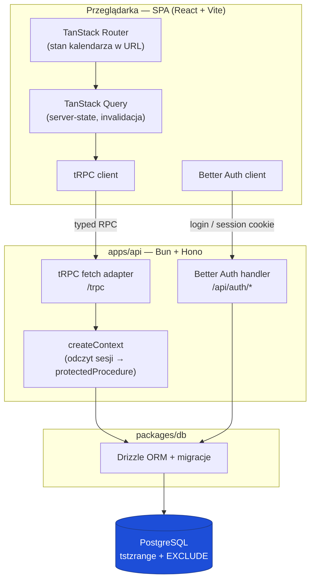
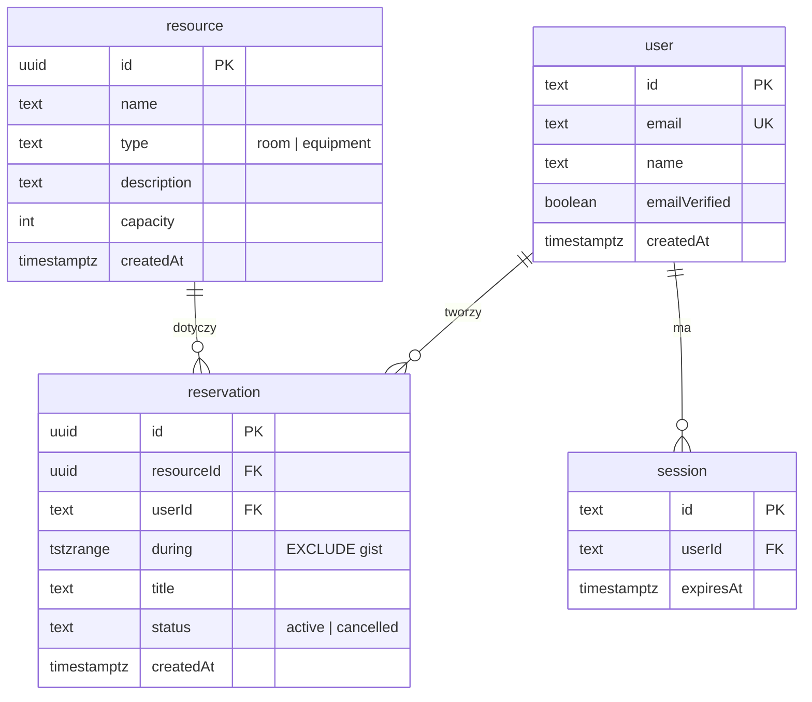
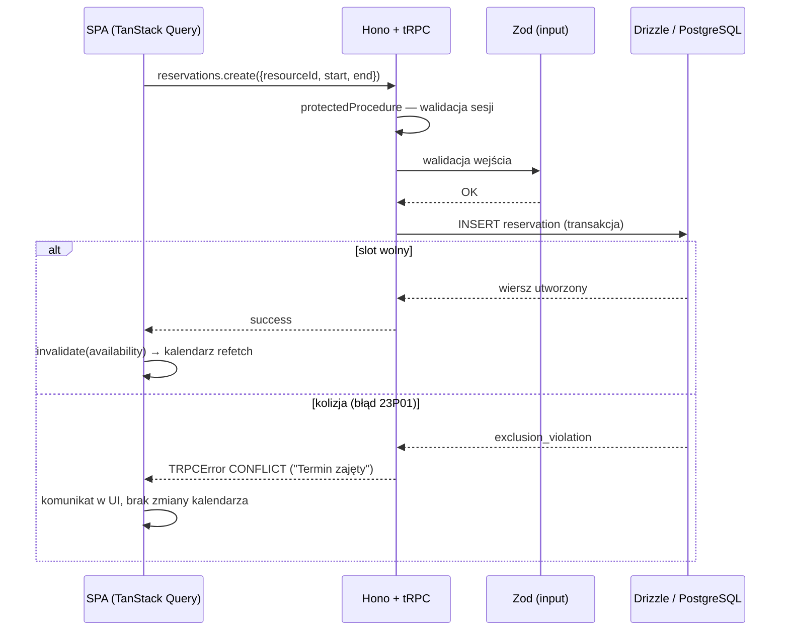

# Design Document — Atrium

**System rezerwacji sal / sprzętu z kalendarzem**
Przedmiot: Projektowanie Aplikacji Internetowych (PAI 2025/2026)
*(Atrium to nazwa robocza — można podmienić.)*

Decyzje technologiczne i ich uzasadnienia są opisane w osobnym dokumencie [`ADR.md`](./ADR.md). Ten dokument opisuje **co** budujemy i **jak** to działa.

---

## 1. Cel i zakres

Atrium pozwala zalogowanym użytkownikom rezerwować współdzielone zasoby (sale, sprzęt) na wybrane przedziały czasu, z widokiem kalendarza pokazującym dostępność. Centralnym problemem domenowym jest **gwarancja braku podwójnych rezerwacji** tego samego zasobu w nakładających się terminach.

**W zakresie:** przeglądanie zasobów, sprawdzanie dostępności w kalendarzu, tworzenie i anulowanie własnych rezerwacji, logowanie/rejestracja.
**Poza zakresem (świadomie):** płatności, powtarzalne rezerwacje (RRULE), role administracyjne ponad właścicielstwo rezerwacji, powiadomienia push.

## 2. Wymagania

**Funkcjonalne**
- Rejestracja i logowanie; ochrona endpointów rezerwacji.
- Lista zasobów z filtrowaniem po typie.
- Widok kalendarza (tydzień) z zajętością wybranego zasobu.
- Utworzenie rezerwacji na wolny slot; odrzucenie kolidującej.
- Anulowanie własnej rezerwacji.

**Niefunkcjonalne**
- Integralność: niemożliwe nakładające się rezerwacje, nawet przy współbieżności (gwarancja na poziomie bazy).
- Spójność typów na granicy klient–serwer (type-safety end-to-end).
- Uruchomienie całości jedną komendą (`docker compose up`).
- Pokrycie kluczowej logiki testami (≥ 10).

## 3. Architektura wysokiego poziomu

Aplikacja to **modularny monolit** (jeden backend) i **SPA** komunikujące się przez tRPC, spięte przez `docker-compose`. Backend wystawia dwie ścieżki: handler autentykacji Better Auth (`/api/auth/*`) oraz endpoint tRPC (`/trpc`).



Typ `AppRouter` jest eksportowany z `apps/api` i importowany **type-only** przez `apps/web` (zależność workspace) — to nośnik type-safety, bez code generation.

## 4. Model danych

Trzy główne encje powiązane relacjami (R1). Tabele `user`, `session`, `account`, `verification` są zarządzane przez Better Auth; domena dokłada `resource` i `reservation`.



**Kluczowy element schematu** — constraint integralności na `reservation` (dopisywany ręczną migracją SQL, bo Drizzle nie wyraża `EXCLUDE` w builderze):

```sql
CREATE EXTENSION IF NOT EXISTS btree_gist;

ALTER TABLE reservation
  ADD CONSTRAINT reservation_no_overlap
  EXCLUDE USING gist (
    resource_id WITH =,
    during      WITH &&
  ) WHERE (status = 'active');
```

`btree_gist` jest potrzebny, by zmieszać porównanie równości (`resource_id WITH =`) z operatorem nakładania zakresów (`during WITH &&`). Klauzula `WHERE (status = 'active')` sprawia, że anulowane rezerwacje zwalniają termin.

## 5. Kluczowy przepływ: tworzenie rezerwacji i obsługa kolizji

Integralność jest egzekwowana przez bazę, więc aplikacja **nie sprawdza wolności slotu przed zapisem** — próbuje wstawić wiersz i reaguje na ewentualne naruszenie constraintu. To eliminuje race condition między odczytem a zapisem.



## 6. Powierzchnia API (tRPC)

| Procedura | Typ | Ochrona | Opis |
|---|---|---|---|
| `auth.*` | Better Auth handler | — | rejestracja, logowanie, sesja (`/api/auth/*`) |
| `resources.list` | query | publiczna/chroniona | lista zasobów, filtr po `type` |
| `resources.byId` | query | chroniona | szczegóły zasobu |
| `availability.forResource` | query | chroniona | rezerwacje zasobu w danym zakresie dat (pod kalendarz) |
| `reservations.create` | mutation | chroniona | utworzenie rezerwacji; mapuje kolizję na `CONFLICT` |
| `reservations.cancel` | mutation | chroniona + ownership | anulowanie własnej rezerwacji (`status = 'cancelled'`) |
| `reservations.mine` | query | chroniona | rezerwacje zalogowanego użytkownika |

Wejście każdej mutacji jest walidowane schematem **Zod**, który jednocześnie jest źródłem typu `input` — walidacja i typowanie z jednego miejsca.

## 7. Autentykacja i autoryzacja

Better Auth obsługuje rejestrację/logowanie i utrzymuje **sesję w httpOnly cookie**. W `createContext` tRPC odczytujemy sesję z żądania; `protectedProcedure` odrzuca żądania bez ważnej sesji (`UNAUTHORIZED`). Autoryzacja na poziomie zasobu (np. anulowanie tylko własnej rezerwacji) jest sprawdzana w procedurze przez porównanie `reservation.userId` z `ctx.session.user.id` (`FORBIDDEN` w razie niezgodności). Szczegóły wyboru — [ADR-6](./ADR.md).

## 8. Frontend

SPA w React budowane przez Vite. **TanStack Router** trzyma stan widoku kalendarza w typowanych search params (`?week=…&resource=…`), więc widok jest linkowalny i odświeżalny. **TanStack Query** zarządza danymi serwerowymi: po udanej mutacji `reservations.create`/`cancel` unieważniamy zapytanie `availability.forResource`, dzięki czemu kalendarz odświeża się automatycznie. Globalnego store (Redux/Zustand) nie używamy — server-state pokrywa Query, a stan czysto kliencki trzymamy lokalnie. Szczegóły — [ADR-7](./ADR.md).

## 9. Stack technologiczny

| Warstwa | Technologia |
|---|---|
| Język | TypeScript (monorepo, Bun workspaces) |
| Runtime backendu | Bun |
| Warstwa HTTP | Hono |
| API | tRPC |
| Walidacja | Zod |
| Baza | PostgreSQL |
| ORM + migracje | Drizzle |
| Auth | Better Auth (sesje, cookies) |
| Frontend | React + Vite (SPA) |
| Routing / server-state | TanStack Router / TanStack Query |
| Testy | Vitest + Playwright |
| Konteneryzacja | Docker + docker-compose |

Pełne uzasadnienia każdego wyboru: [`ADR.md`](./ADR.md).

## 10. Konteneryzacja i uruchomienie

`docker-compose.yml` podnosi cały stack jedną komendą (R5):

| Serwis | Rola |
|---|---|
| `db` | PostgreSQL (z healthcheck, wolumen na dane) |
| `api` | Bun + Hono; czeka na zdrowy `db`; uruchamia migracje, potem serwer |
| `web` | build Vite serwowany statycznie (lub dev server w trybie deweloperskim) |

Sekwencja startu: `db` → migracje Drizzle (w tym migracja z `EXCLUDE`) → `api` → `web`. Skrypt `seed` wypełnia bazę przykładowymi zasobami i rezerwacjami do demo.

## 11. Strategia testów

- **Jednostkowe (Vitest):** czysta logika pomocnicza (parsowanie zakresów dat, mapowanie błędów bazy na błędy tRPC, helpery kalendarza).
- **Integracyjne (Vitest + realny Postgres z compose):** najważniejsze — próba utworzenia kolidującej rezerwacji musi zwrócić `CONFLICT`; anulowanie zwalnia termin; ochrona endpointów bez sesji.
- **E2E (Playwright):** happy-path (logowanie → rezerwacja slotu) oraz scenariusz kolizji w UI.

Constraint z ADR-4 testujemy na prawdziwej bazie, nigdy na mocku — inaczej test nie weryfikuje faktycznej gwarancji.

## 12. Elementy dodatkowe (opcjonalne)

Dodawane tylko, jeśli realnie wykorzystane i uzasadnione:

| Element | Zastosowanie |
|---|---|
| Walidacja | Zod jako `input` tRPC (wdrożone w core) |
| Seed data | komenda wypełniająca bazę do demo (wdrożone w core) |
| Cache | Redis/Valkey na zapytania o dostępność popularnych zakresów — z TTL i invalidacją po zapisie |
| Task queue | asynchroniczne maile-przypomnienia o nadchodzącej rezerwacji |
| Dokumentacja API | eksport tRPC → OpenAPI lub panel tRPC |

## 13. Świadomie pominięte

Mikroserwisy / broker komunikatów ([ADR-9](./ADR.md)) oraz deployment na edge z Hyperdrive ([ADR-10](./ADR.md)) zostały rozważone i odrzucone jako złożoność bez wartości przy tej skali.

## 14. Możliwe rozszerzenia

Powtarzalne rezerwacje (reguły RRULE), role i uprawnienia administracyjne, kalendarz wielu zasobów obok siebie, eksport iCal, warstwa analityczna (obłożenie zasobów w czasie).